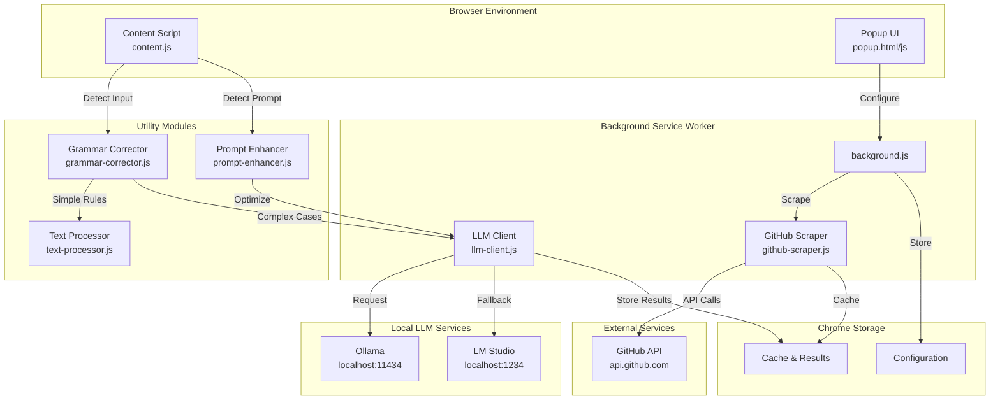
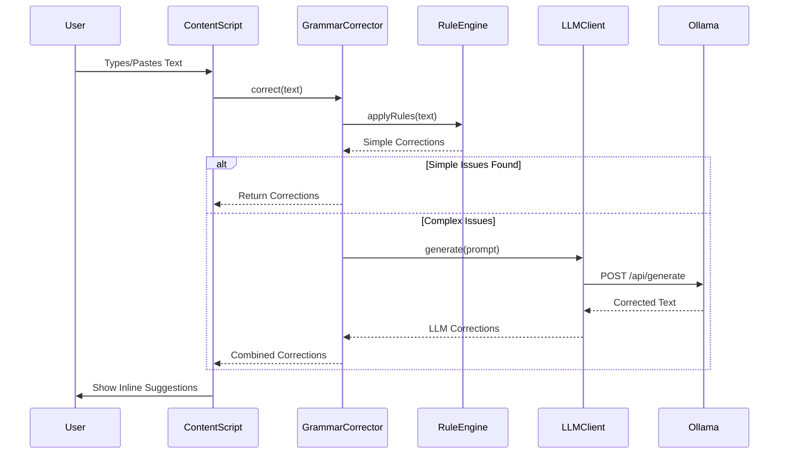
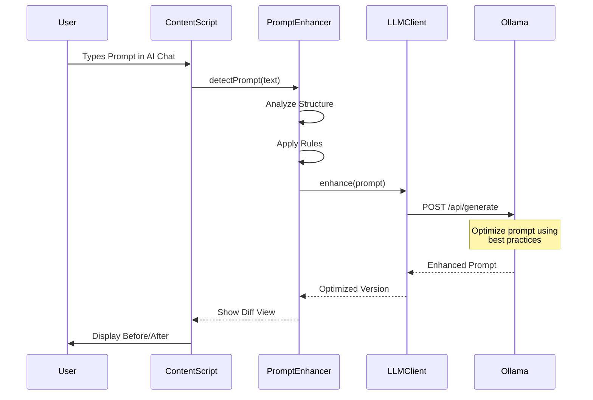
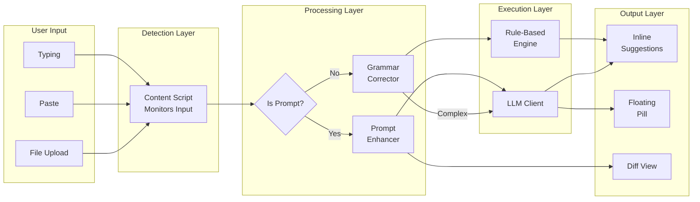
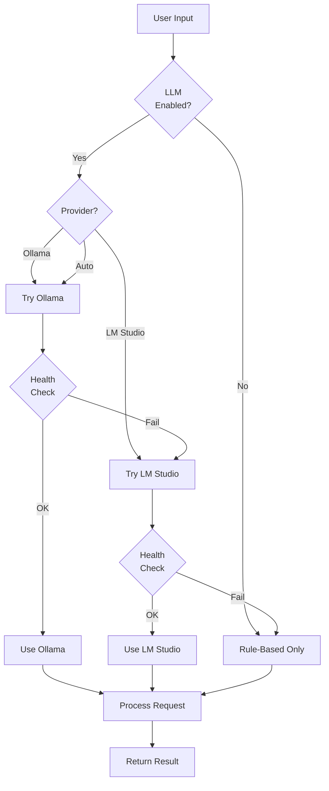
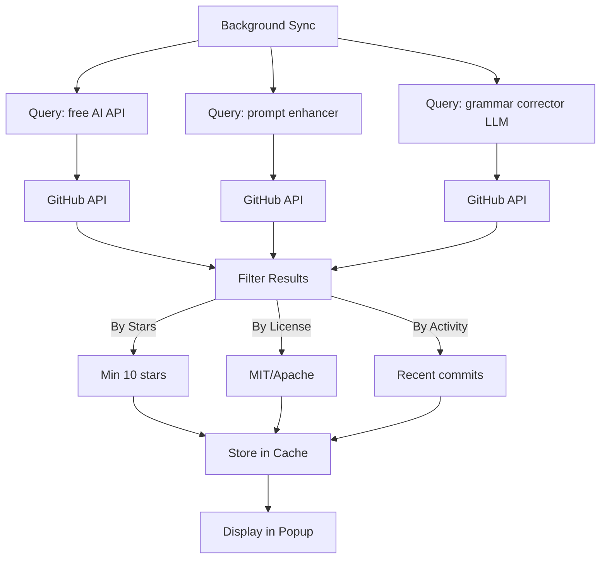
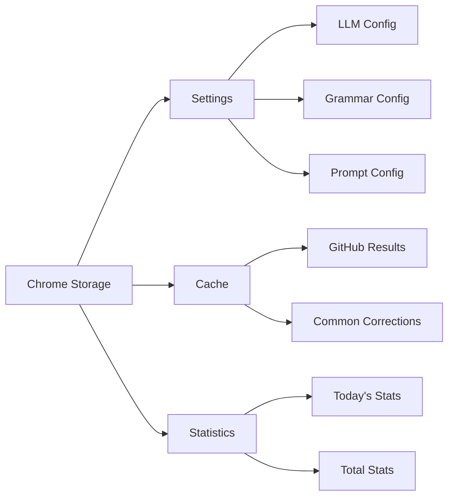

# Architecture Diagram: Grammar Enhancer Extension

## System Architecture

## Data Flow: Grammar Correction

## Data Flow: Prompt Enhancement

## Component Interaction

## LLM Fallback Strategy

## GitHub Scraper Flow

## Storage Schema

